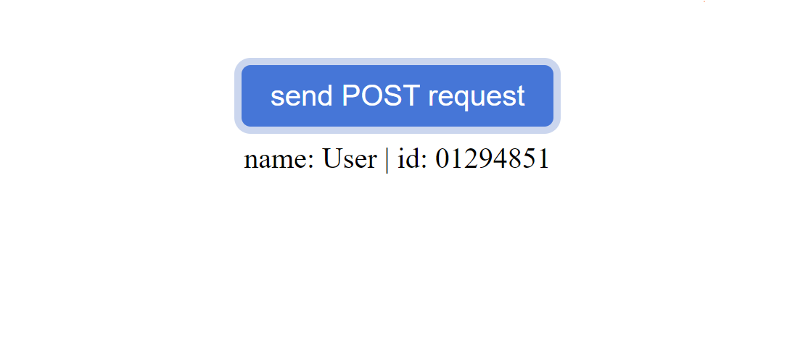
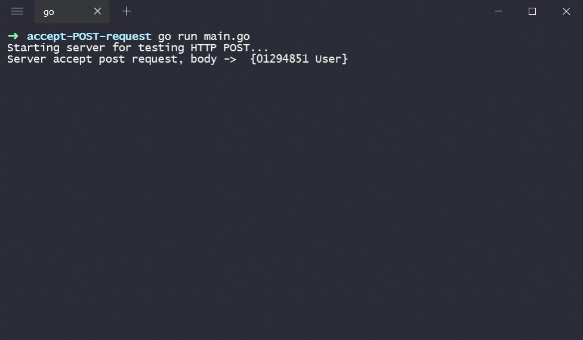

# Accept POST request Golang

Element `<button>` 
```html
<button id="btn"> send POST request</button>
```

We will send JSON object, when button is clicked:

```js
var user = {
      name: "User",
      id: "01294851"
    }

    var p = document.getElementById("object")
    p.innerHTML = `name: ${user.name} | id: ${user.id} `

    document.getElementById('btn').onclick = () => {
      fetch('/api', {
        method: 'POST',
        headers: {
          'Accept': 'application/json',
          'Content-Type': 'application/json'
        },
        body: JSON.stringify(user)
      });
    }
```

in order to accept a request on the server:

1. Create struct 
```golang
type User struct {
	ID   string `json:"id"`
	Name string `json:"name"`
}
```
2. Start server
```golang 
func main() {
	http.HandleFunc("/", hendler)
	fmt.Printf("Starting server for testing HTTP POST...\n")
	if err := http.ListenAndServe(":8080", nil); err != nil {
		log.Fatal(err)
	}
}
```

3. Make hendler func which process `GET` and `POST` requests
```golang
func hendler(w http.ResponseWriter, r *http.Request) {
	switch r.Method {
	case "GET":
		http.ServeFile(w, r, "index.html")
	case "POST":
		b, err := ioutil.ReadAll(r.Body)
		defer r.Body.Close()
		if err != nil {
			http.Error(w, err.Error(), 500)
			return
		}
		user := User{}
		json.Unmarshal([]byte(b), &user)

		fmt.Println("Server accept post request, body -> ", user)
	}
}
```
* If a GET request comes, return the html page 
* If a POST request comes, Read body and `Println` it 

****
### Click on button

and in terminal -> 


